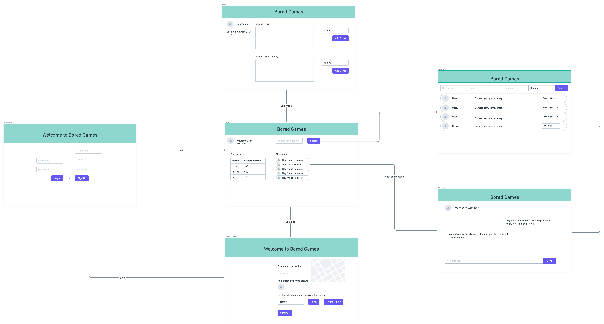

#Tet Milestone 1
##Part 0: Data Interactions
The website is a place where different users can connect to play in person board games.
This means we need an account for every user.
Each account includes important data: username, email, password,
unique user ID, geo-location (town), list of games they play and games they own.
The only public data will be username and list of games they play/own.
The geo-location will be provided by the user and they only have to give their town name,
not street address, although they may use current location to make their experience easier.

##Part 1: Wireframes

<h2>HTML and CSS</h2>
See our html files