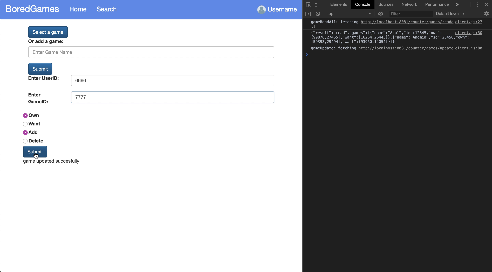
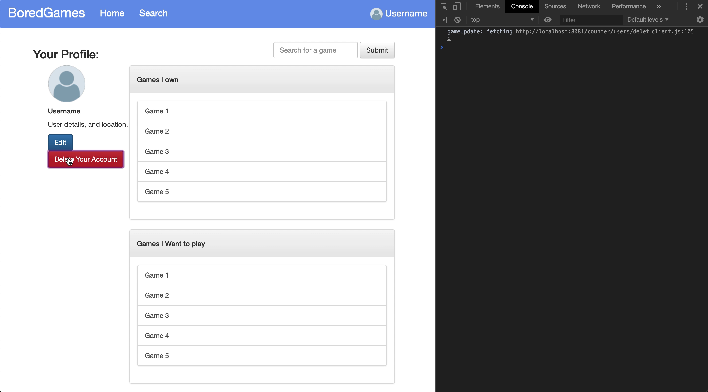

#Tet Milestone 2
by Konrad, Kash, and Doug
##Games API Documentations

<!--
we need an api for get/update game description, and get/update user profile
i think we should skip delete functionality for now
for example:
-->

Users will be able to create and read games from the database.
###Create
This will allow us to create new games. The user will put in the games name and a new game will be created with that name.
####Endpoint URI and Parameters
`{server:port}/games/create`

| Parameter | Description                      | Example              |
| --------- | -------------------------------- | -------------------- |
| name      | (required) The name of the game. | `name:Secret Hitler` |

#### Responses

The Games API returns response data in a JSON object. Details below.

| Key    | Value Type | Description                                               |
| ------ | ---------- | --------------------------------------------------------- |
| result | string     | The type of operation status: one of "created" or "error" |
| name   | string     | The name of the game created.                             |

###Read
This will allow us to create new games. The user will put in the games name and a new game will be created with that name.
####Endpoint URI and Parameters
`{server:port}/games/read`

| Parameter | Description                    | Example     |
| --------- | ------------------------------ | ----------- |
| game      | (required) The id of the game. | game: 19484 |

#### Responses

The Games API returns response data in a JSON object. Details below.

| Key    | Value Type | Description                                            |
| ------ | ---------- | ------------------------------------------------------ |
| result | string     | The type of operation status: one of "read" or "error" |
| name   | string     | The name of the game.                                  |
| id     | number     | The id of the game.                                    |
| own    | array      | Array of users who own the game.                       |
| want   | array      | Array of users who want to play the game.              |

###ReadAll
This gives us an array of all the games collection.
####Endpoint URI and Parameters
`{server:port}/games/readall`

No parameters.

#### Responses

The Games API returns response data in a JSON object. Details below.

| Key    | Value Type | Description                                                  |
| ------ | ---------- | ------------------------------------------------------------ |
| result | string     | The type of operation status: one of "read" or "error"       |
| games  | array      | An array of objects containing all the games and their data. |

###Update
This lets us update the games to add users to either the own or want array using a POST request.
####Endpoint URI and Parameters
`{server:port}/games/update`

All parameters are required.

| Parameter | Description                                                               | Example        |
| --------- | ------------------------------------------------------------------------- | -------------- |
| game      | The id of the game to update.                                             | id : 12345     |
| user      | The user id to add/remove from the games collection.                      | user_id : 5678 |
| own       | Boolean value to determine whether we are updating the own or want array. | own : true     |
| add       | Boolean value to determine whether we are adding or removing the user.    | add : true     |

####Responses

| Key    | Value Type | Description                                               |
| ------ | ---------- | --------------------------------------------------------- |
| result | string     | The type of operation status: one of "updated" or "error" |
| id     | number     | The id of updated game.                                   |

##Users API Documentation

###Create
This is called when a user creates an account.

####Endpoint URI and Parameters
`{server:port}/users/create`

| Parameter | Description                            | Example              |
| --------- | -------------------------------------- | -------------------- |
| name      | (required)The user's desired username. | username : ChessWhiz |
| password  | (required)A users desired password.    | password : Pword123  |
| img       | User's profile picture.                | img : rook.jpg       |
| zip       | (required)Users zip code.              | zip : 01002          |

####Responses
| Key | Value Type | Description |
|--------|------------|-----------------------------------------------------------|
| result | string | The type of operation status: one of "created" or "error" |
| name | string | The user's name. |
| id | number | The id of created user. |

###Read
This will generally be called when viewing a user profile.

####Endpoint URI and Parameters
`{server:port}/users/read`

| Parameter | Description                      | Example                            |
| --------- | -------------------------------- | ---------------------------------- |
| id        | (required)The desired user's id. | `{server:port}/users/read?id=1234` |

####Responses
| Key | Value Type | Description |
|---------|------------|-----------------------------------------------------------|
| result | string | The type of operation status: one of "read" or "error". |
| name | string | The user's name. |
| id | number | The user id. |
| zip | string | The user's zip code. |
| picture | file | The users profile picture. |
| own | array | Array containing the IDs of games owned by the user. |
| want | array | Array containing the IDs of games the user wants to play. |

###Update
This is used to update a user's picture, location, or games.

####Endpoint URI and Parameters
`{server:port}/users/update`

| Parameter | Description                                                          | Example        |
| --------- | -------------------------------------------------------------------- | -------------- |
| id        | (required)The user's id.                                             | id : 1234      |
| img       | A new profile picture for the user.                                  | img: panda.png |
| zip       | A new location for the user.                                         | zip: 11215     |
| add       | Whether user is adding or removing a game from the list.             | add: false     |
| own       | Is the game being added/removed from the owned or want to play list. | own: true      |
| game      | The id of the game being added or removed.                           | game: 69392    |

####Responses
| Key | Value Type | Description |
|--------|------------|-----------------------------------------------------------|
| result | string | The type of operation status: one of "updated" or "error" |
| id | number | The id of created user. |

###Delete
This is used when a user wants to delete their account.

####Endpoint URI and Parameters
`{server:port}/users/delete`

| Parameter | Description              | Example   |
| --------- | ------------------------ | --------- |
| id        | (required)The user's id. | id : 1234 |

####Responses
| Key | Value Type | Description |
|--------|------------|-----------------------------------------------------------|
| result | string | The type of operation status: one of "deleted" or "error" |
| id | number | The id of created user. |

##Front-end Typescript

We send the server a name for the new game and the server returns a success or failure and the new game id

We send the server a request to read all games, and the server responds with an array of games which includes an id, and an array of owners and people who want to play the game

When someone adds a game to the collection you update the games database with the person added to the owned / want to play array

We send the userid to the server and the server deletes that user from the database.

##Deployment

<!--
compile ts into js(obviously) and deploy on heroku
-->
run:
npm init -y in order to make package.json and package-lock.json
in the file package.json in the field "scripts", add the line:
'"start" : "npm server-main.ts"'
next 
create a new file called "Procfile" and write "web: node server-main.js"

heroku git:remote -a 326tet
heroku buildpacks:set heroku/nodejs

git add .
git commit -m "setting up heroku server"
git push
git push heroku master